Nissan Stock Forecasting
================
Shea

# Project Goals

In this project, I do a time series analysis and forecast Nissan stock
prices. The goal is to predict the future stock price as accurately as
possible while using historical data about the stock itself as well as
related events.

## Nissan Motor Corporation (NSANY)

Nissan Motor Co Ltd (Nissan) is an automobile manufacturer. It carries
out the design, production and sale of automobile products. The
company’s product portfolio includes sedans, compact cars, SUVs, sports
cars, mini vans, kei cars, light commercial vehicles, and related parts.
The company offers automobiles under the brand names of Nissan,
Infiniti, and Datsun, among others. Nissan also provides credit card and
leasing services, non-life insurance and auto financing services. The
company markets its products and services through a network of retail
outlets in Asia Pacific, Europe, the Middle East, Africa and the
Americas. Nissan is headquartered in Japan. (Source:
<https://www.globaldata.com/company-profile/nissan-motor-co-ltd/>)

In 2021, Nissan sold 3.88 million vehicles between China, North America,
Japan, Europe, and other global (35.6%, 30.5%, 11.1%, 8.8%, and 14.0%
respectively) with global consolidated net sales of 8.42 trillion yen,
or \$56.6 billion, making them the 7th largest automaker in the world.
(Source: <https://www.nissan-global.com/EN/IR/FINANCE/GLOBALSALES/>)

### Obtain stock data

I’ve obtained stock and other relevant data for six years of data
2016-2021 in order to forecast stock values in 2022 through September.
The stock prices for 2022 have also been obtained to assess the accuracy
of my forecasting.

``` r
# get data
# format as tsibble
nissan_daily <- getSymbols(
  "NSANY", # ticker symbol
  from = "2016-01-01", # start date
  to = "2022-09-30", # end date
  auto.assign = FALSE # assign variable 'XOM'
  ) %>%
  timetk::tk_tbl() %>%
  select(index,NSANY.Close) %>%
  rename(date = index, price = NSANY.Close) %>%
  as_tsibble(index = date)
```

``` r
# review data

head(nissan_daily)
```

    ## # A tsibble: 6 x 2 [1D]
    ##   date       price
    ##   <date>     <dbl>
    ## 1 2016-01-04  20.5
    ## 2 2016-01-05  20.6
    ## 3 2016-01-06  19.9
    ## 4 2016-01-07  19.3
    ## 5 2016-01-08  18.8
    ## 6 2016-01-11  19.1

``` r
autoplot(nissan_daily, price) +
  labs(title = 'Nissan Stock Daily Closing Price'
       ,subtitle = 'Ticker NSANY'
       ,x = 'Date'
       ,y = 'USD $')
```

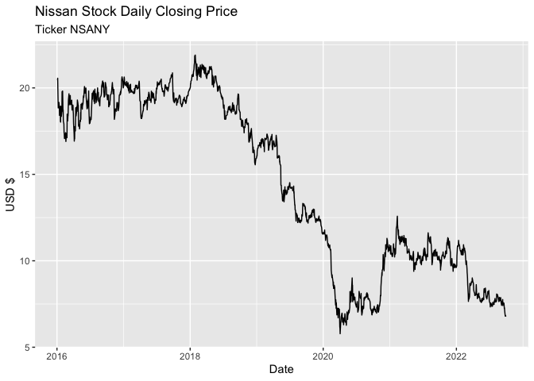<!-- -->

Here I summarize Nissan daily stock prices down to monthly (mean by
month). This is so that I can make forecasts using other data that’s
only available monthly. It also has the beneficial effect of removing a
great deal of daily variation we’re not interested in for long-run stock
forecasting.

``` r
# monthly
nissan <- nissan_daily %>%
  mutate(month = yearmonth(date)) %>%
  index_by(month) %>%
  summarize(price = mean(price))

# split into "past" and future"
nissan_past <- nissan %>%
  filter(year(month) <= 2021)
nissan_future <- nissan %>%
  filter(year(month) == 2022)

# plot monthly
autoplot(nissan, price) +
  labs(title = 'Nissan Stock Monthly Price'
       ,subtitle = 'Ticker NSANY'
       ,x = 'Date'
       ,y = 'USD $')
```

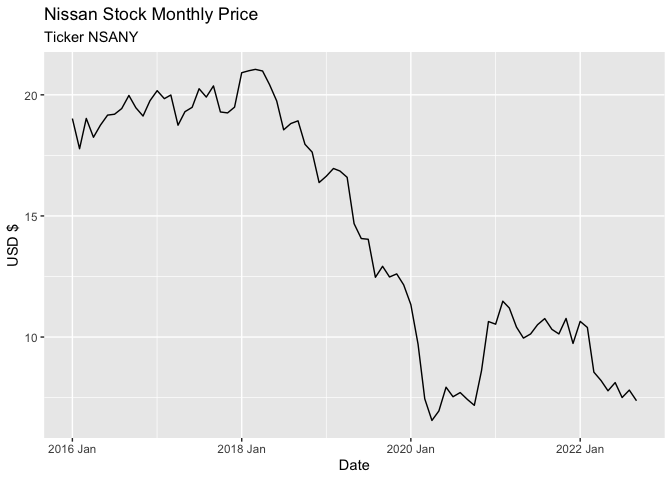<!-- -->

## Forecasting Considerations

<!-- For full points:

Additional factors were considered thoroughly. One or more additional factors were modeled.

-->

How well an event can be predicted or forecast depends on dynamics
inherent to the event.

-   The amount of knowledge and interpretability of the event dynamics
-   Access to data about the event, its history, and related phenomena
-   The continuation of patterns and event relationships from past to
    future
-   The effect of forecasting on the event itself

This conceptual framework has implications for stocks

-   There is some understanding of price affecting factors, but there
    are too many to be exhaustive
-   Lots of usable data exists
-   There are numerous new and unpredictable events that affect stock
    prices
-   Due to the nature of interest in the stock market, aggregate
    predicted/forecasted values are priced into current prices

### Data Collection and Construction

In class we considered Nashville housing with a pandemic dummy variable
that was 1 for May 2020 to June 2021 and 0 for all other months. Here,
I’ve constructed a more subtle pandemic variable. It is 1 starting in
May 2020 for six months and then decreases by 0.1 each month through
August 2021 when it levels off at 0. This is my attempt to model the
initial shock of the pandemic and then its lessening effects.

``` r
# additional constructed factor

# pandemic
# produced in excel
pandemic <- read_csv(file = 'pandemic.csv') %>%
  mutate(month = yearmonth(month)) %>%
  filter((year(month) >= 2016) & (year(month) <= 2021))
```

For the models requiring additional data (TSLM and Dynamic Regression),
I’ve loaded data with the same timeframe as the “past” Nissan stock
price but left out the more recent data that coincides with the time
I’ll be forecasting. This simulates a realistic forecasting scenario
where I won’t know this other data in advance.

The data I’ve collected includes:

-   Nissan vehicle sales
    -   I pulled these individually for each month from Nissan investor
        press releases
    -   I anticipate that vehicle sales will have a strong impact on the
        Nissan stock price
-   World GDP from Nasdaq Data Link
    -   As a general measure of global economic activity, this may have
        effects
-   US/Japanese Exchange Rate from FRED (Federal Reserve Economic Data)
    -   As global profits are repatriated, the value of the Japanese Yen
        may have effects
-   Oil Price from FRED
    -   Oil prices may affect consumer vehicle purchasing decisions
-   Toyota Stock Price
    -   Toyota is a competitor and a company that faces some of the same
        dynamics.

``` r
# collected

# retail car sales
# source: https://www.nissan-global.com/EN/IR/FINANCE/RESULTS/2017/
vehicles <- read_csv(file = 'nissan_sales.csv') %>%
  mutate(month = yearmonth(month)) %>%
  filter((year(month) >= 2016) & (year(month) <= 2021))

# world real gross domestic product, monthly
# source: https://data.nasdaq.com/data/EIA/STEO_RGDPQ_WORLD_M-world-real-gross-domestic-product-monthly
world_gdp <- Quandl("EIA/STEO_RGDPQ_WORLD_M", api_key="HxtTL4QpqYPQrsnBLD3S") %>%
  as_tibble() %>%
  mutate(month = yearmonth(Date)) %>%
  rename(world_gdp = Value) %>%
  select(month, world_gdp) %>%
  filter((year(month) >= 2016) & (year(month) <= 2021))

# us japan exchange rate
# source: https://fred.stlouisfed.org/series/EXJPUS
us_jp_exch <- read_csv(file = 'EXJPUS.csv') %>%
  mutate(month = yearmonth(DATE)) %>%
  rename(us_jp_exch = EXJPUS) %>%
  select(month, us_jp_exch) %>%
  filter((year(month) >= 2016) & (year(month) <= 2021))

# oil prices
# source: https://fred.stlouisfed.org/series/POILBREUSDM
oil_price <- read_csv(file = 'POILBREUSDM.csv') %>%
  mutate(month = yearmonth(DATE)) %>%
  rename(oil_price = POILBREUSDM) %>%
  select(month, oil_price) %>%
  filter((year(month) >= 2016) & (year(month) <= 2021))

# toyota stock prices
tm <- getSymbols(
  "TM", # ticker symbol
  from = "2016-01-01", # start date
  to = "2021-12-31", # end date
  auto.assign = FALSE # assign variable 'XOM'
  ) %>%
  timetk::tk_tbl() %>%
  select(index,TM.Close) %>%
  rename(date = index, tm_price = TM.Close) %>%
  mutate(month = yearmonth(date)) %>%
  group_by(month) %>%
  summarize(tm_price = mean(tm_price))
```

``` r
# combined historical data

nissan_past <- tibble(nissan_past
                      ,vehicles[,2]
                      ,world_gdp[,2]
                      ,us_jp_exch[,2]
                      ,oil_price[,2]
                      ,tm[,2]
                      ,pandemic[,2]) %>%
  as_tsibble(index = month)
```

## Decomposition

<!-- For full points:

Trend and seasonality were decomposed and their appropriateness were discussed. Model parameters were reported. Visualizations were used.

-->

### STL Decomposition

In the graphs and figures below, there is evidence of a strong trend and
weak seasonality.

The trend is level from Jan 2016 to Jan 2018 with a strong downward
slope from Jan 2018 to mid 2020. There is a slight recovery thereafter.

Although there is an identifiable seasonal pattern with peaks in January
and troughs mid-year, the scale is very small. The insignificance of the
seasonal effect can be seen better in the second graph. The seasonally
adjusted line in purple differs only slightly from the non-adjusted data
in gray.

``` r
# stl decomposition
dcmp <- nissan_past %>%
  model(stl = STL(price))

# plot
components(dcmp) %>% autoplot()
```

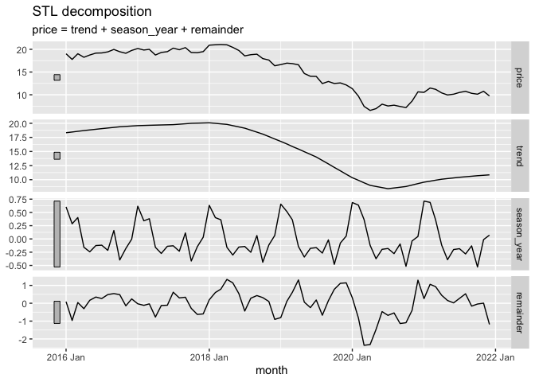<!-- -->

``` r
# stl trend and seasonally adjusted
nissan_past %>%
  autoplot(price, color = 'dark gray') +
  autolayer(components(dcmp), trend, color = 'blue') + # plot trend color = '#D55E00'
  autolayer(components(dcmp), season_adjust, color = 'purple') +
  labs(title = 'STL decomposition 2')
```

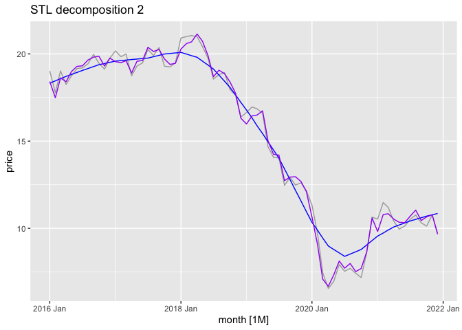<!-- -->

The figures below restate that the trend strength is high and the
seasonality is low.

``` r
nissan_past %>% features(price, feat_stl)
```

    ## # A tibble: 1 × 9
    ##   trend_strength seaso…¹ seaso…² seaso…³ spiki…⁴ linea…⁵ curva…⁶ stl_e…⁷ stl_e…⁸
    ##            <dbl>   <dbl>   <dbl>   <dbl>   <dbl>   <dbl>   <dbl>   <dbl>   <dbl>
    ## 1          0.975   0.183       1      10 1.99e-4   -33.4   -5.53   0.621   0.694
    ## # … with abbreviated variable names ¹​seasonal_strength_year,
    ## #   ²​seasonal_peak_year, ³​seasonal_trough_year, ⁴​spikiness, ⁵​linearity,
    ## #   ⁶​curvature, ⁷​stl_e_acf1, ⁸​stl_e_acf10

## Model Selection

<!-- For full points:

At least two different models were considered. Model fit and residual diagnostics were thoroughly discussed (for all models).

-->

### ETS Modeling

I’ve begun with exponential smoothing modeling. I specify a model with
additive error, trend, and season while also allowing the fable package
to estimate an automated model for comparison.

``` r
nissan_ets_fit <- nissan_past %>%
  model(ets_aaa = ETS(price ~ error('A') + trend('A') + season('A'))
        ,ets_auto = ETS(price))

accuracy(nissan_ets_fit)
```

    ## # A tibble: 2 × 10
    ##   .model   .type         ME  RMSE   MAE     MPE  MAPE  MASE RMSSE  ACF1
    ##   <chr>    <chr>      <dbl> <dbl> <dbl>   <dbl> <dbl> <dbl> <dbl> <dbl>
    ## 1 ets_aaa  Training -0.0283 0.743 0.581  0.0702  4.62 0.185 0.187 0.121
    ## 2 ets_auto Training -0.133  0.787 0.602 -1.19    4.74 0.192 0.199 0.144

``` r
report(nissan_ets_fit[,2])
```

    ## Series: price 
    ## Model: ETS(A,N,N) 
    ##   Smoothing parameters:
    ##     alpha = 0.9999 
    ## 
    ##   Initial states:
    ##      l[0]
    ##  19.33772
    ## 
    ##   sigma^2:  0.6372
    ## 
    ##      AIC     AICc      BIC 
    ## 279.4436 279.7965 286.2736

While my ETS(AAA) model performs better for RMSE, the fable-selected
ETS(ANN) model performs better on AICc, our preferred metric for model
comparisons across the same type.

Inspecting the ETS(ANN) model parameters more closely, `alpha` controls
the flexibility of the level. Here the `alpha` is very close to 1, where
the level updates completely based on the previous value. The level
portion of the ETS model is essentially naive. `beta` and `gamma` for
trend and seasonality are not present in this model. This seems like a
reasonable result for a stock, where the best naive (no other
information) prediction for price today is what the price was yesterday.

``` r
nissan_ets_fit %>%
  select(ets_auto) %>%
  gg_tsresiduals()
```

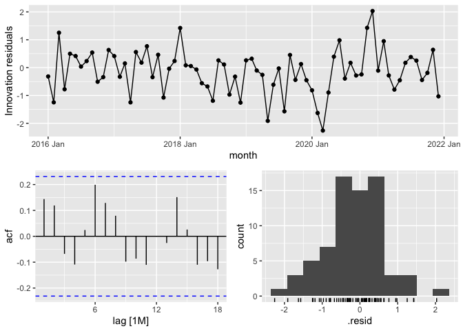<!-- -->

Looking at the residuals of the ETS(ANN), the residuals appear close to
white noise, the autocorrelation (while exhibiting some patterned
behavior) is not significant, and the residual distribution is roughly
normal (the left tail may cause prediction interval issues).

``` r
# Plot model
nissan_ets_fit %>%
  select(ets_auto) %>%
  augment() %>%
  # Plot month on x-axis
  ggplot(aes(x = month)) +
  # Plot actual values
  geom_line(aes(x = month,y = price, color = 'Data')) +
  # Plot fit values
  geom_line(aes(y = .fitted, color = 'Model')) +
  scale_color_manual(name = '',
                     breaks=c('Data', 'Model'),
                     values=c('Data'='dark gray', 'Model'='orange'))
```

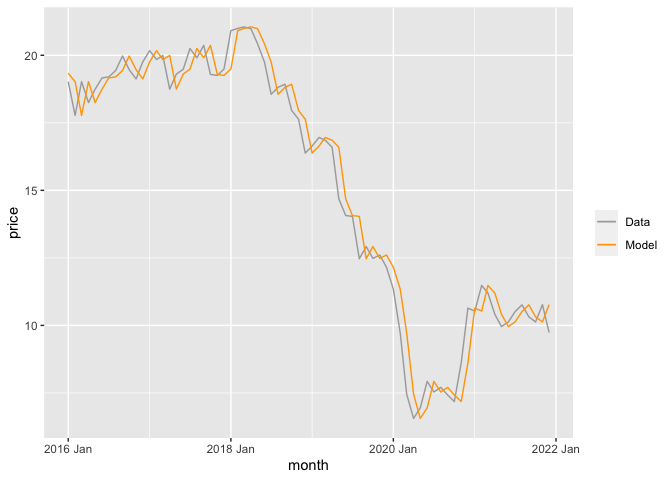<!-- --> The
fitted plot is as expected. The prediction of this month’s price is last
month’s price.

### Baseline Models

Here I assess several baseline models to compare to the later more
advanced models. They include a Mean model, which is the mean stock
price across time, a Naive model, which is the price from the previous
time point, and a Drift model, which is the price from the previous time
point along with a drift or trend factor.

``` r
# fit models
nissan_baseline_fit <- nissan_past %>%
  model(
    mean = MEAN(price),
    naive = NAIVE(price),
    drift = NAIVE(price ~ drift())
  )

report(nissan_baseline_fit[,1])
```

    ## Series: price 
    ## Model: MEAN 
    ## 
    ## Mean: 15.206 
    ## sigma^2: 22.3171

``` r
report(nissan_baseline_fit[,2])
```

    ## Series: price 
    ## Model: NAIVE 
    ## 
    ## sigma^2: 0.6184

``` r
report(nissan_baseline_fit[,3])
```

    ## Series: price 
    ## Model: RW w/ drift 
    ## 
    ## Drift: -0.1308 (se: 0.0933)
    ## sigma^2: 0.6184

``` r
accuracy(nissan_baseline_fit)
```

    ## # A tibble: 3 × 10
    ##   .model .type           ME  RMSE   MAE     MPE  MAPE  MASE RMSSE  ACF1
    ##   <chr>  <chr>        <dbl> <dbl> <dbl>   <dbl> <dbl> <dbl> <dbl> <dbl>
    ## 1 mean   Training  1.48e-16 4.69  4.34  -13.0   35.4  1.38  1.18  0.972
    ## 2 naive  Training -1.31e- 1 0.792 0.606  -1.18   4.78 0.193 0.200 0.139
    ## 3 drift  Training -1.80e-16 0.781 0.605  -0.206  4.71 0.193 0.197 0.139

The Drift model performs best for fit across all metrics and will be
used as a baseline.

``` r
nissan_baseline_fit %>%
  select(drift) %>%
  gg_tsresiduals()
```

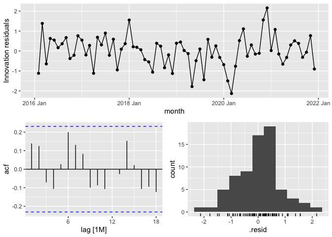<!-- -->

Looking at the residuals of the Drift model, the residuals appear close
to white noise, the autocorrelation (while exhibiting some patterned
behavior) is not significant, and the residual distribution is roughly
normal (the left tail may cause prediction interval issues).

``` r
# Plot model
nissan_baseline_fit %>%
  select(drift) %>%
  augment() %>%
  # Plot month on x-axis
  ggplot(aes(x = month)) +
  # Plot actual values
  geom_line(aes(x = month,y = price, color = 'Data')) +
  # Plot fit values
  geom_line(aes(y = .fitted, color = 'Model')) +
  scale_color_manual(name = '',
                     breaks=c('Data', 'Model'),
                     values=c('Data'='dark gray', 'Model'='orange'))
```

<!-- -->

The Drift model is largely based on the previous period value, so the
graph is as expected.

### TSLM

Next I fit a time series linear model.

``` r
nissan_tslm_fit <- nissan_past %>%
  model(tslm = TSLM(price ~ vehicles + world_gdp + us_jp_exch + oil_price + tm_price + pandemic))


report(nissan_tslm_fit)
```

    ## Series: price 
    ## Model: TSLM 
    ## 
    ## Residuals:
    ##     Min      1Q  Median      3Q     Max 
    ## -4.9072 -1.3269  0.2143  1.3430  4.9625 
    ## 
    ## Coefficients:
    ##               Estimate Std. Error t value Pr(>|t|)    
    ## (Intercept)  2.082e+01  1.760e+01   1.183  0.24106    
    ## vehicles     2.179e-05  4.361e-06   4.997 4.66e-06 ***
    ## world_gdp   -2.509e-02  1.076e-01  -0.233  0.81641    
    ## us_jp_exch  -2.036e-02  9.154e-02  -0.222  0.82467    
    ## oil_price    9.240e-02  3.128e-02   2.954  0.00436 ** 
    ## tm_price    -1.114e-01  2.483e-02  -4.486 3.02e-05 ***
    ## pandemic    -4.873e+00  1.089e+00  -4.474 3.16e-05 ***
    ## ---
    ## Signif. codes:  0 '***' 0.001 '**' 0.01 '*' 0.05 '.' 0.1 ' ' 1
    ## 
    ## Residual standard error: 2.221 on 65 degrees of freedom
    ## Multiple R-squared: 0.7976,  Adjusted R-squared: 0.7789
    ## F-statistic: 42.68 on 6 and 65 DF, p-value: < 2.22e-16

``` r
accuracy(nissan_tslm_fit)
```

    ## # A tibble: 1 × 10
    ##   .model .type           ME  RMSE   MAE   MPE  MAPE  MASE RMSSE  ACF1
    ##   <chr>  <chr>        <dbl> <dbl> <dbl> <dbl> <dbl> <dbl> <dbl> <dbl>
    ## 1 tslm   Training -7.73e-17  2.11  1.68 -2.26  12.2 0.535 0.533 0.583

In the model report, we can see that vehicle sales, Toyota stock price,
pandemic variable, and oil price are all significant in predicting
Nissan stock price. While one must be careful in drawing conclusions
from coefficients, it’s not surprising that vehicle sales has a positive
effect and that pandemic has a negative effect.

The positive effect of oil prices may indicate that consumers prefer
Nissan’s fuel-efficient offerings during these times, but it also may
simply be an indicator of the health/activity of the economy. The
negative coefficient for Toyota stock price is intriguing. Nissan and
Toyota are competitors, so one’s gain may be another’s loss. But they
are also companies that are affected by many of the same dynamics. This
correlation may be a composite of positives and negatives.

``` r
nissan_tslm_fit %>%
  gg_tsresiduals()
```

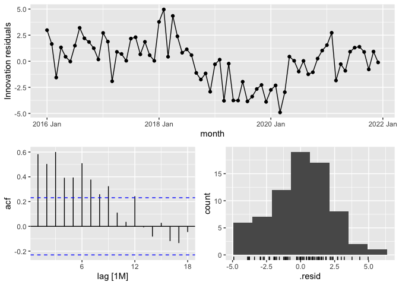<!-- -->

The residuals here are not like white noise and exhibit clear patters.
The autocorrelations are highly significant for many periods. And the
residual distribution is off from normal. These indicate that there are
patterns and information remaining in the errors/residuals that our
model does not account for. For instance, the model does not include any
lag for previous price values, so the autocorrelations are not
surprising.

``` r
# Plot model
nissan_tslm_fit %>%
  augment() %>%
  # Plot month on x-axis
  ggplot(aes(x = month)) +
  # Plot actual values
  geom_line(aes(x = month,y = price, color = 'Data')) +
  # Plot fit values
  geom_line(aes(y = .fitted, color = 'Model')) +
  scale_color_manual(name = '',
                     breaks=c('Data', 'Model'),
                     values=c('Data'='dark gray', 'Model'='orange'))
```

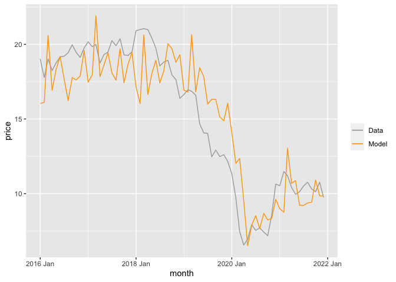<!-- -->

Here we can see that vehicle sales have a large impact on stock prices.

``` r
ggplot(nissan_past) +
  geom_line(aes(x = month,y = vehicles)) +
  labs(title = 'Nissan Vehicle Sales')
```

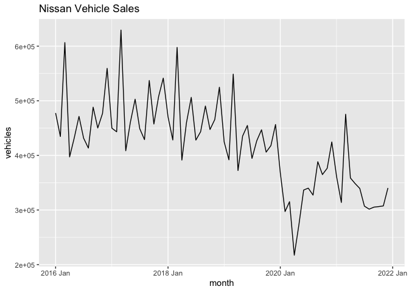<!-- -->

### ARIMA and Dynamic

Next I fit ARIMA and Dynamic Regression models.

#### Check for Stationarity

Because of the clear trend in the stock price, the data is not
stationary. The Kwiatkowski-Phillips-Schmidt-Shin (KPSS) test confirms.
Differencing and testing again shows stationary data.

``` r
# unit root test

nissan_past %>%
  features(price, unitroot_kpss) # fails
```

    ## # A tibble: 1 × 2
    ##   kpss_stat kpss_pvalue
    ##       <dbl>       <dbl>
    ## 1      1.58        0.01

``` r
nissan_past %>%
  mutate(diff_price = difference(price)) %>%
  features(diff_price, unitroot_kpss) # pass
```

    ## # A tibble: 1 × 2
    ##   kpss_stat kpss_pvalue
    ##       <dbl>       <dbl>
    ## 1     0.146         0.1

#### Fit

``` r
nissan_arima_fit <- nissan_past %>%
  model(arima = ARIMA(price)
        ,dynamic = ARIMA(price ~ vehicles + tm_price + oil_price + pandemic))

accuracy(nissan_arima_fit)
```

    ## # A tibble: 2 × 10
    ##   .model  .type           ME  RMSE   MAE    MPE  MAPE  MASE RMSSE   ACF1
    ##   <chr>   <chr>        <dbl> <dbl> <dbl>  <dbl> <dbl> <dbl> <dbl>  <dbl>
    ## 1 arima   Training -0.129    0.786 0.598 -1.16   4.72 0.190 0.199 0.135 
    ## 2 dynamic Training  0.000139 0.580 0.463 -0.108  3.30 0.147 0.146 0.0580

``` r
report(nissan_arima_fit[,1])
```

    ## Series: price 
    ## Model: ARIMA(0,1,0) 
    ## 
    ## sigma^2 estimated as 0.6268:  log likelihood=-84.16
    ## AIC=170.32   AICc=170.38   BIC=172.59

``` r
report(nissan_arima_fit[,2])
```

    ## Series: price 
    ## Model: LM w/ ARIMA(0,1,0) errors 
    ## 
    ## Coefficients:
    ##       vehicles  tm_price  oil_price  pandemic  intercept
    ##              0    0.0534     0.0605    0.0213    -0.2135
    ## s.e.       NaN    0.0131     0.0147    0.5654     0.0452
    ## 
    ## sigma^2 estimated as 0.3671:  log likelihood=-62.57
    ## AIC=137.15   AICc=138.46   BIC=150.72

The dynamic regression model outperforms the ARIMA model on all error
measures. It takes into account trends in the time series as well as the
external data we have (vehicle sales, oil price, etc.). We can see that
both include a first differencing.

``` r
nissan_arima_fit %>%
  select(dynamic) %>%
  gg_tsresiduals()
```

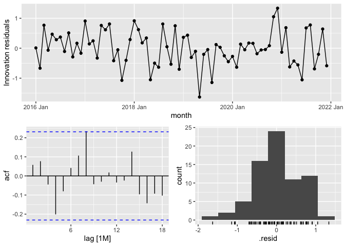<!-- --> The
residuals appear as white noise. The autocorrelations are within
acceptable levels. And the residuals appear somewhat normal, but the
prediction intervals may not be reliable.

``` r
# Plot model
nissan_arima_fit %>%
  select(dynamic) %>%
  augment() %>%
  # Plot month on x-axis
  ggplot(aes(x = month)) +
  # Plot actual values
  geom_line(aes(x = month,y = price, color = 'Data')) +
  # Plot fit values
  geom_line(aes(y = .fitted, color = 'Model')) +
  scale_color_manual(name = '',
                     breaks=c('Data', 'Model'),
                     values=c('Data'='dark gray', 'Model'='orange'))
```

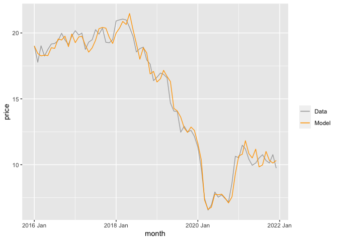<!-- -->

## Forecast

<!-- For full points:

At least one forecast was made using actual data and another using a forecasting method. Forecasts were visualized and confidence bands were interpreted. Point and distributional fit measures were discussed for both.

-->

Based on the fitting results, I’ll be comparing the forecast performance
of the ETS, Drift, and Dynamic Regression models.

``` r
# fit comparison models
nissan_fit <- nissan_past %>%
  model(
    drift = NAIVE(price ~ drift())
    ,ets = ETS(price)
    ,dynamic = ARIMA(price ~ vehicles + tm_price + oil_price + pandemic)
    )
```

For the Dynamic Regression model, it’s necessary to project the
explanatory variables used in the model. While leaving a great deal of
room for improvement, here I use the most recent historical value
(December 2021) for each (vehicle sales, Toyota stock price, oil price,
and pandemic) into the nine months of the 2022 forecast.

``` r
# construct future data
nissan_predict_data <- new_data(nissan_past,9) %>%
  mutate(vehicles = tail(nissan_past$vehicles,1)
         ,tm_price = tail(nissan_past$tm_price,1)
         ,oil_price = tail(nissan_past$oil_price,1)
         ,pandemic = 0)
```

``` r
# produce forecast
nissan_fc <- nissan_fit %>%
  forecast(new_data = nissan_predict_data)

# plot forecasts
nissan_fc %>%
  autoplot(level = 50, alpha = 0.6) +
  autolayer(nissan_past, price) +
  autolayer(nissan_future, price, color = 'gray') +
  labs(y = 'USD $',
       title = 'Nissan Stock Daily Closing Price',
       subtitle = 'Forecasts with 50% Interval')
```

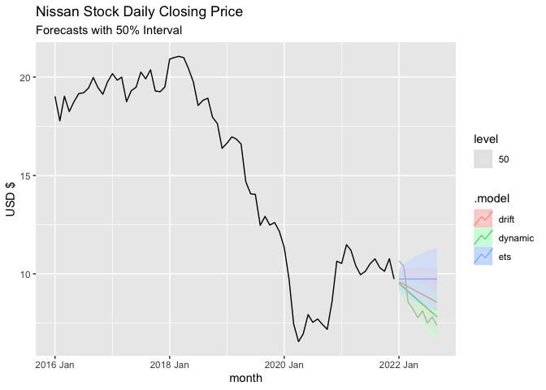<!-- -->

``` r
# accuracy measures

# point accuracy
nissan_fc %>%
  accuracy(nissan_future)
```

    ## # A tibble: 3 × 10
    ##   .model  .type     ME  RMSE   MAE    MPE  MAPE  MASE RMSSE  ACF1
    ##   <chr>   <chr>  <dbl> <dbl> <dbl>  <dbl> <dbl> <dbl> <dbl> <dbl>
    ## 1 drift   Test  -0.595 1.05  1.03   -8.31 12.5    NaN   NaN 0.488
    ## 2 dynamic Test  -0.181 0.737 0.673  -3.09  7.76   NaN   NaN 0.425
    ## 3 ets     Test  -1.25  1.69  1.60  -16.6  19.9    NaN   NaN 0.553

``` r
# distributional
nissan_fc %>%
  accuracy(nissan_future,
    list(winkler_50 = winkler_score, crps = CRPS), level = 50)
```

    ## # A tibble: 3 × 4
    ##   .model  .type winkler_50  crps
    ##   <chr>   <chr>      <dbl> <dbl>
    ## 1 drift   Test        2.70 0.669
    ## 2 dynamic Test        2.30 0.508
    ## 3 ets     Test        4.13 0.964

In point estimate performance, the models perform in order from best to
worse, Dynamic Regression, Drift, and ETS. The ordering is the same for
the distributional measures (Winkler and CRPS). Numerically and
graphically, I’m not particularly impressed with these forecasts. The
ETS model is obviously not useful. While Drift and Dynamic Regression
are closer and make for good practice, they should not be part of an
investment strategy.

## Interpretation

<!-- For full points:

Interpretation of the forecast was based on past and present knowledge of the stock and how it's situated in the investment ecosystem. Differences between forecast and actual are discussed based on current knowledge or events.

-->

The ETS model is essentially naive and therefore simply forecasts the
most recent value. If the stock price doesn’t change, this is an
accurate forecast. That’s not the case here. It’s perhaps the case that
ETS(ANN) was better for fitting but that a trended version may have been
better for forecasting.

Both the Drift and the Dynamic Regression models do a better job of
forecasting by capturing the downward trend of the stock price over
time. The capturing of this downward trend based on the historical
performance (particularly 2018-2020) was somewhat “lucky” in my opinion.
Vehicle sales continued to decrease in 2022, which affected the stock
price. But that fact was not incorporated into either of these models.
The forecasts also missed the somewhat ahistorical vehicle sales
performance in January 2022, giving the stock a temporary elevation.

The Dynamic Regression model could have be improved further by more
sophisticated attempts at projecting its explanatory variables. For
instance, stock analysts make estimates of vehicle sales. Those could be
researched and incorporated into the model. The same applies to future
Toyota stock or oil prices.

Altogether, this exercise demonstrates the difficulties in forecasting
something as complex and multi-faceted as a company’s stock price. While
confirming that a fundamental such as vehicles sales does affect stock
price, properly finding and selecting all relevant factors is
impossible. Stock prices are also intensely researched and acted upon by
investors. Making forecasts that are not already “priced in” by the
activities of other investors informed by forecasting is also quite
difficult, so I would not pursue this area for profit as an amateur.
